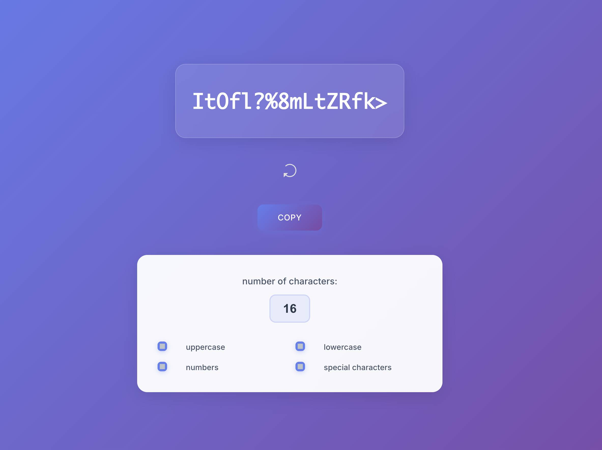

# Quick Password Generator 🔒

A modern, clean, and secure password generator with a beautiful glassmorphic design. Generate strong, customizable passwords instantly with an intuitive interface that works perfectly on any device.



## ✨ Features

### 🛡️ **Secure Password Generation**
- **Cryptographically Random** - Uses JavaScript's built-in random number generator
- **Customizable Length** - Generate passwords from 1 to 30 characters
- **Character Type Control** - Toggle uppercase, lowercase, numbers, and special characters
- **Real-time Generation** - Passwords update instantly as you change settings
- **No Data Collection** - Everything happens locally in your browser

### 🎨 **Modern Design**
- **Glassmorphic UI** - Beautiful translucent cards with backdrop blur effects
- **Responsive Layout** - Works perfectly on desktop, tablet, and mobile devices
- **Smooth Animations** - Subtle hover effects and transitions throughout
- **Clean Typography** - Easy-to-read monospace display for generated passwords
- **Intuitive Controls** - Simple checkbox interface for customization

### 📋 **Copy Functionality**
- **One-Click Copy** - Copy button with visual feedback
- **Click Password to Copy** - Click directly on the generated password
- **Success Indicators** - Green checkmark confirmation when copied
- **Multiple Copy Methods** - Both button and password click work seamlessly

## 🚀 Quick Start

### Online Usage
Visit [jessnunez.com/password](https://jessnunez.com/password) to use the generator immediately - no installation required!

### Self-Hosted Setup
1. **Clone the repository**
   ```bash
   git clone https://github.com/wpjess/quick-password.git
   cd quick-password
   ```

2. **Serve the files**
   - Upload to any web server
   - Or run locally with: `python -m http.server 8000`
   - No server-side processing required!

3. **Access the tool**
   - Open `index.html` in any modern web browser
   - Start generating secure passwords immediately

## 🛠️ Usage

### Basic Password Generation
1. **Automatic Generation** - A password appears immediately when you load the page
2. **Customize Length** - Use the number input to set password length (1-30 characters)
3. **Select Character Types** - Check/uncheck boxes for:
   - **Uppercase letters** (A-Z)
   - **Lowercase letters** (a-z)  
   - **Numbers** (0-9)
   - **Special characters** (!@#$%^&*()...)
4. **Copy Your Password** - Click the copy button OR click directly on the password

### Advanced Features
- **Real-time Updates** - Password regenerates automatically when you change any setting
- **New Password Button** - Click the refresh button to generate a new password with current settings
- **Visual Feedback** - Success indicators confirm when password is copied to clipboard

## 📁 File Structure

```
quick-password/
├── index.html           # Main application file
├── style.css           # Modern CSS styles with glassmorphic design
├── images/
│   ├── screenshot.jpg   # Tool preview image
│   └── icon.png        # Favicon
└── README.md           # This file
```

## 🔧 Technical Details

### Frontend Technologies
- **Pure HTML/CSS/JavaScript** - No frameworks or dependencies
- **Modern CSS** - Glassmorphism, CSS Grid, Flexbox, and smooth animations
- **Responsive Design** - Mobile-first approach with breakpoints
- **Progressive Enhancement** - Works on all modern browsers

### Password Generation Algorithm
```javascript
function newPassword() {
    var length = number,
        charset = char,
        retVal = "";
    for (var i = 0, n = charset.length; i < length; ++i) {
        retVal += charset.charAt(Math.floor(Math.random() * n));
    }
    return retVal;
}
```

### Character Sets
- **Uppercase**: `ABCDEFGHIJKLMNOPQRSTUVWXYZ`
- **Lowercase**: `abcdefghijklmnopqrstuvwxyz`
- **Numbers**: `123456789` (excludes 0 to avoid confusion)
- **Special Characters**: `&^%$#@!*()+~?<>`

## 🎨 Customization

### Styling
The tool uses modern CSS with:
- **CSS Custom Properties** for easy color scheme changes
- **Glassmorphic Design** with backdrop-filter effects
- **Smooth Transitions** throughout the interface
- **Mobile-First Responsive Design**

### Color Scheme
Default gradient: Purple-blue (`#667eea` to `#764ba2`)
- Easily customizable in the CSS file
- High contrast for accessibility
- Modern glassmorphic elements

### Adding Character Sets
To add new character types, modify the JavaScript:
```javascript
// Add to character set
char += 'YOUR_NEW_CHARACTERS';
```

## 🔐 Security Considerations

### Client-Side Generation
- **No Network Requests** - Passwords generated entirely in your browser
- **No Logging** - No passwords are stored or transmitted anywhere
- **Secure Random** - Uses JavaScript's Math.random() for entropy

### Best Practices
- **Use Maximum Length** - Longer passwords are exponentially stronger
- **Include All Character Types** - Maximum entropy for security
- **Generate Fresh Passwords** - Don't reuse across multiple accounts
- **Store Securely** - Use a password manager for storage

## 📱 Browser Compatibility

- **Chrome/Edge** 80+
- **Firefox** 75+
- **Safari** 13+
- **Mobile Browsers** - Full iOS/Android support

## 🤝 Contributing

1. Fork the repository
2. Create a feature branch (`git checkout -b feature/amazing-feature`)
3. Commit your changes (`git commit -m 'Add amazing feature'`)
4. Push to the branch (`git push origin feature/amazing-feature`)
5. Open a Pull Request

## 📝 License

This project is open source and available under the [MIT License](LICENSE).

## 🐛 Issues & Support

If you encounter any issues or have suggestions:
1. Check the [Issues](https://github.com/wpjess/quick-password/issues) page
2. Create a new issue with detailed information
3. Include browser version and steps to reproduce

## 🚀 Future Enhancements

Potential features for future versions:
- **Password Strength Indicator** - Visual feedback on password security
- **Multiple Password Generation** - Generate several passwords at once
- **Custom Character Sets** - User-defined character pools
- **Password History** - Optional session-based history (never stored)
- **Export Options** - Download passwords as secure files

## 🔗 Links

- **GitHub Repository**: [wpjess/quick-password](https://github.com/wpjess/quick-password)
- **Live Demo**: [Quick Password Generator](https://jessnunez.com/password)
- **More Tools**: [jessnunez.com](https://jessnunez.com)

## 💡 Why Another Password Generator?

In a world full of password tools, this one focuses on:
- **Simplicity** - No unnecessary features or complexity
- **Modern Design** - Beautiful, intuitive interface
- **Privacy** - Everything happens locally
- **Accessibility** - Works great on all devices
- **Open Source** - Transparent and customizable

---

**Made with 🔒 by Jess** - Keeping your passwords strong and your data private
